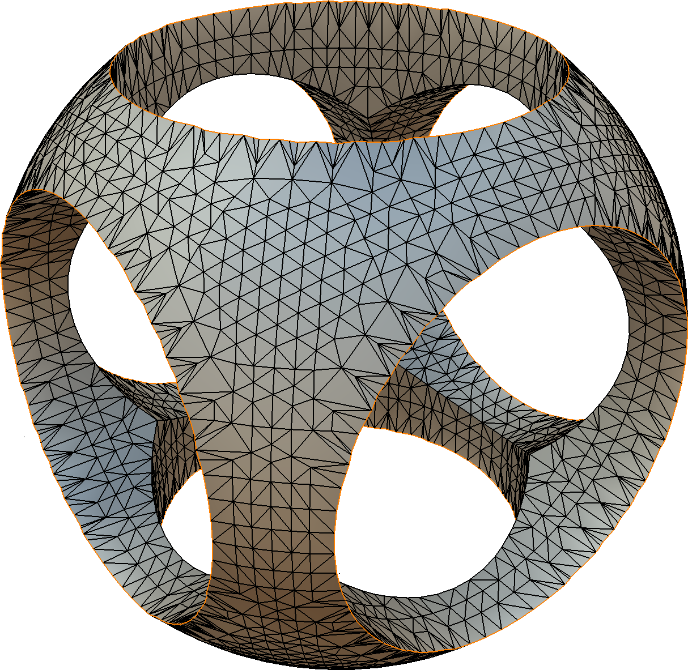

# `libfive` 

A Rust wrapper for [*libfive*](https://libfive.com/).

## Example

```rust
use libfive::*;

let f_rep_shape = Tree::sphere(1.0.into(), TreeVec3::default())
    .difference_multi(vec![
        Tree::sphere(0.6.into(), TreeVec3::default()),
        Tree::cylinder_z(
            0.6.into(),
            2.0.into(),
            TreeVec3::new(0.0, 0.0, -1.0),
        ),
        Tree::cylinder_z(
            0.6.into(),
            2.0.into(),
            TreeVec3::new(0.0, 0.0, -1.0),
        )
        .reflect_xz(),
        Tree::cylinder_z(
            0.6.into(),
            2.0.into(),
            TreeVec3::new(0.0, 0.0, -1.0),
        )
        .reflect_yz(),
    ]);

f_rep_shape.to_stl(
    "f_rep_shape.stl",
    &Region3::new(-2.0, 2.0, -2.0, 2.0, -2.0, 2.0),
    // Resolution
    0.01,
)?;
```

This results in this STL mesh:



## Documentation

Build docs locally:
```
cargo doc -p libfive --no-deps --all-features --open
```

## Features

* [`ahash`](https://crates.io/crates/ahash) – On by default. Use [`AHashMap`](https://docs.rs/ahash/latest/ahash/struct.AHashMap.html)
  for hashing when resolving variable names. Disabling this will fall back
  to the slower [`HashMap`](std::collections::HashMap).

* `stdlib` – On by default. Add an extensive list of higher level operations
  – the *libfive stdlib*.

  To disable either/both of the above features unset default features in
  `Cargo.toml`:

  ```toml
  [dependencies.libfive]
  default-features = false
  ```

* `packed_opcodes` - Tightly pack opcodes. This breaks compatibility with
  older saved f-rep files.

## Dependencies

### macOS

With `homebrew` installed, run:

```
brew install cmake pkg-config eigen libpng boost
```

### Ubuntu/Debian

`libfive` should build out of the box on the latest Ubuntu LTS (currently
20.04). If you find that's not the case, please open an issue in the [upstream
repository](https://github.com/libfive/libfive/issues)!

Install the following dependencies with `apt`:

```
sudo apt-get install cmake pkg-config libeigen3-dev libpng-dev libboost-all-dev
```

### Arch Linux

Install the following dependencies:

```
sudo pacman -S cmake pkgconf eigen libpng boost boost-libs
```

### Windows (VS2019)

Install [Git](https://git-scm.com/download/win), choosing settings so that it
can be invoked from a Windows _Command Prompt_ (the defaults should be fine).

Install [VS2019](https://visualstudio.microsoft.com/vs/) (Community Edition),
configured for `Desktop development with C++`.

You _only_ need _MSVC_, _Windows 10 SDK_, and _C++ CMake tools for Windows_.
Feel free to uncheck other optional packages in the right sidebar.
Then run the installation!

Next, install dependencies using `vcpkg`.

> :warning: This step touches many files, so you may want to disable the _Antimalware
Service Executable_, which will otherwise scan every single file and slow things
down dramatically: in `Windows Security`→`Virus & threat protection settings`,
uncheck `Real-time protection`.

In a Windows _Command Prompt_:
```
git clone https://github.com/Microsoft/vcpkg.git
.\vcpkg\bootstrap-vcpkg.bat
.\vcpkg\vcpkg.exe install --triplet x64-windows eigen3 boost-container boost-bimap boost-interval boost-lockfree boost-functional boost-algorithm boost-math libpng
```
Go get some coffee or something – this will take a while.

# Building

Just the usual.

```
cargo build
```
